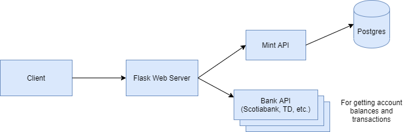

# System Design - Mint Implementation

Simple implementation of Mint. This repository will be helpful for those wishing to learn more about system design. I have written a simple REST api in flask and provided a few docker commands for a spinning up a database and redis cache.

I have provided some comments in this README on how to scale the design.

Based on suggestions in https://github.com/donnemartin/system-design-primer/blob/master/solutions/system_design/mint/README.md.

## Design

## Frontend

* Frontend is part of ``mint-app`` (port 5000)
* See ``mint-app/app/templates``

## Backend

* mint-api written using ``flask`` (port 5000)
* mimic third party banks in third-party folder
    * abc_bank_api written using ``flask`` (port 5001)
    * xyz_bank_api written using ``flask`` (port 5002)
    * xyz_trade_api written using ``flask`` (port 5003)
* sqlite used for database 
* redis cache running using ``docker`` (port 6379)